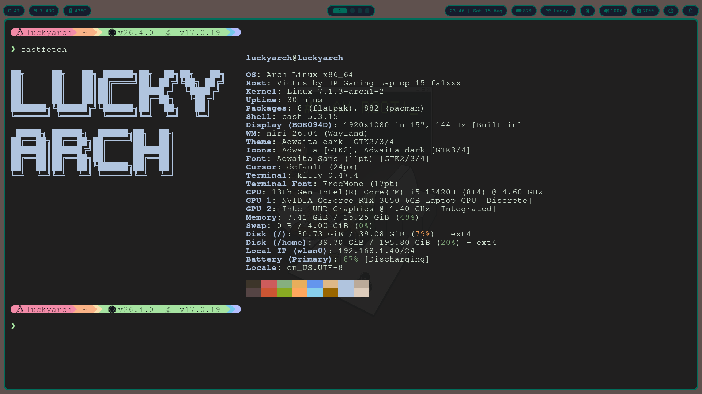
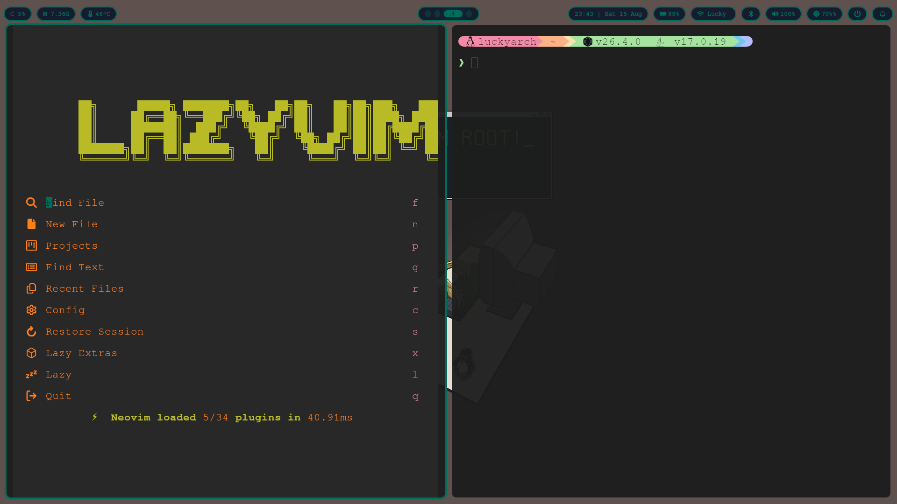
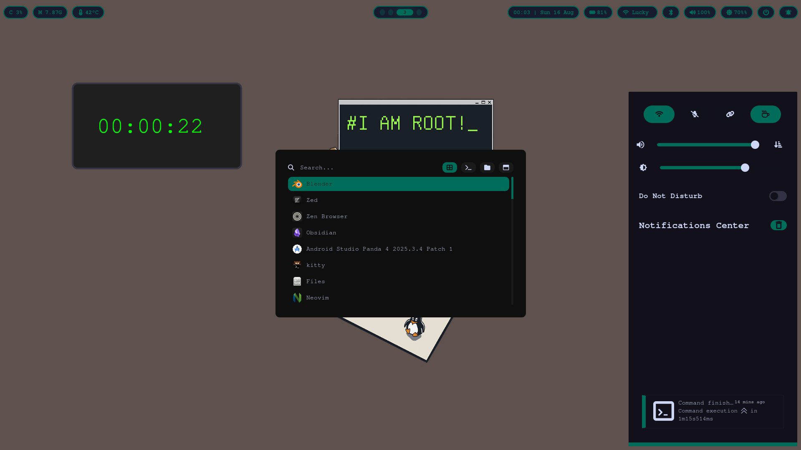
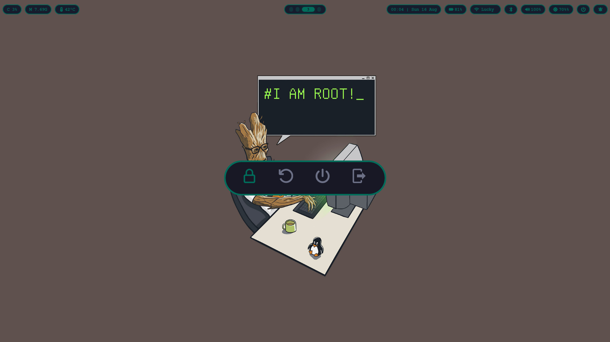
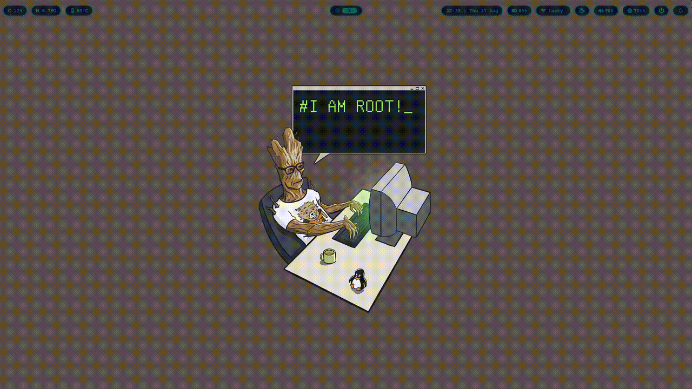

# LuckyDE

> My personal **Arch Linux desktop environment** and dotfiles — built around **Niri + Hyprland**, with a terminal-first workflow and a minimal, cohesive UI.

---

## ✨ Overview

LuckyDE is my personal Arch Linux desktop configuration, combining two Wayland compositors with a collection of tools for everyday use, development, system management, and customization.

The setup is built around **Niri** as the primary compositor and **Hyprland** as an alternative compositor

---

## 📸 Screenshots

| | |
|:---:|:---:|
|  |  |
| **System & Terminal Information** — Customized Fastfetch alongside the terminal-focused environment. | **Neovim / LazyVim** — Development setup featuring Neovim with LazyVim and Kitty. |
|  |  |
| **Rofi & SwayNC** — Rofi provides the application launcher while SwayNC handles notifications and quick system controls. | **Waybar & Powermenu** — Customized Waybar with system information and controls, including the Rofi-based powermenu. |

---

## 🎨 Theme System



LuckyDE includes a centralized theme system for changing the appearance of the desktop from a single theme selector.

Themes control:

- Primary accent color
- Inactive/focus colors
- Foreground/text colors
- Critical/urgent colors
- Wallpaper
- Kitty theme
- Neovim colorscheme
- Waybar styling
- SwayNC styling
- Rofi styling

Themes are stored in:

```text
~/.config/theme/themes/
```

Current themes:

```text
themes/
├── blue/
└── groot/
```

Each theme contains its own colors, configuration, and wallpaper.

### Switching themes

Switch directly from the terminal:

```bash
~/.config/theme/switch.sh blue
```

or:

```bash
~/.config/theme/switch.sh groot
```

The theme system updates the relevant configuration and reloads the UI.

### Theme selector

Launch the Rofi theme selector using the Niri keybinding:

**`Mod + Shift + T`**

Or change it directly from the terminal:

```bash
~/.config/theme/switch.sh blue
```

---

## 🔄 Theme Architecture

The theme system uses the theme files as the source of truth and generates the configuration required by the different applications.

```text
┌────────────────────────────┐
│       Theme Directory      │
│                            │
│ themes/blue/theme.sh       │
│ themes/groot/theme.sh      │
└─────────────┬──────────────┘
              │
              │ switch.sh
              ▼
┌────────────────────────────┐
│      apply-theme.sh        │
│                            │
│ • Colors                   │
│ • Wallpaper                │
│ • Kitty                    │
│ • Neovim                   │
└─────────────┬──────────────┘
              │
              ▼
┌────────────────────────────┐
│       generate.sh          │
│                            │
│ Generates runtime configs  │
└─────────────┬──────────────┘
              │
       ┌──────┼──────┬────────┐
       ▼      ▼      ▼        ▼
    Waybar  SwayNC  Rofi     Niri
```

Generated configuration files are runtime files and are recreated automatically.

---

## 💾 Remembered Theme

The selected theme is restored automatically when Niri starts.

```text
Niri starts
     │
     ▼
restore-theme.sh
     │
     ▼
current-theme
     │
     ▼
apply-theme.sh
     │
     ▼
generate.sh
```

This allows the desktop to return to the same theme after reboot.

---

## 🔧 Script Management

Reusable runtime shell scripts are centralized in:

```text
~/.config/scripts/
```

These include scripts for:

- Audio
- Brightness
- Caffeine mode
- Screen locking
- Power management
- System synchronization

The repository synchronization script is:

```bash
~/niri-dotfiles/scripts/sync.sh
```

Run it from the repository:

```bash
./scripts/sync.sh
```

### Sync workflow

```text
┌─────────────────────┐
│     ~/.config/      │
│  Live configuration │
└──────────┬──────────┘
           │
           │ sync.sh
           ▼
┌─────────────────────┐
│   ~/niri-dotfiles/  │
│      Git repo       │
└──────────┬──────────┘
           │
           ▼
       git add .
           │
           ▼
      git commit
           │
           ▼
       git push
```

The sync script also updates the package lists.

Runtime-generated files and machine-specific theme state are excluded from the repository.

---

## 📦 Package Lists

The repository maintains package lists for several package sources.

| File | Description |
|:---|:---|
| `pkglist.txt` | Official Arch packages |
| `aurlist.txt` | AUR packages |
| `flatpaklist.txt` | Flatpak applications |
| `npmlist.txt` | Global npm packages |

These lists are automatically generated by:

```bash
./scripts/sync.sh
```

### Official Arch packages

```bash
pacman -Qqe > pkglist.txt
```

### AUR packages

```bash
pacman -Qqem > aurlist.txt
```

### Flatpak applications

```bash
flatpak list --app --columns=application | sort > flatpaklist.txt
```

### Global npm packages

The global npm package list is generated automatically by `sync.sh`.

---

## 🚀 Installation

The repository includes `install.sh` to simplify setting up the environment on another Arch Linux machine.

### 1. Clone the repository

```bash
git clone https://github.com/Im-1ucky/niri-dotfiles.git
cd niri-dotfiles
```

### 2. Install the configuration

Run:

```bash
./install.sh
```

The installer:

- Backs up existing configuration
- Installs dotfiles and scripts
- Sets up the theme system
- Generates required runtime files

Packages are **not installed by default**.

### 3. Install packages

To install the package lists as well:

```bash
./install.sh --packages
```

This handles:

- Official Arch packages using `pacman`
- AUR packages using `yay` or `paru`
- Flatpak applications
- Global npm packages

For AUR packages, the installer automatically uses `yay` if available, otherwise `paru`.

If neither is installed, AUR packages are skipped.

> Review the package lists before installing them on another system. Some packages may be unnecessary or incompatible with different hardware or workflows.

### 4. Restart

After installation:

```bash
reboot
```

Niri will automatically restore the selected theme on startup.

---

## 🛡️ Configuration Backups

Before installing, `install.sh` creates a timestamped backup:

```text
~/.config-backup-YYYYMMDD-HHMMSS/
```

Existing configuration directories are moved into the backup before the repository configuration is installed.

---

## 🧩 Components

| Component | Purpose |
|:--|:--|
| **Niri** | Primary scrollable-tiling Wayland compositor |
| **Hyprland** | Alternative dynamic-tiling Wayland compositor |
| **Waybar** | System status bar |
| **SwayNC** | Notifications and quick controls |
| **Kitty** | Terminal emulator |
| **Rofi** | Application launcher, theme selector, and power menu |
| **Neovim / LazyVim** | Code editor |
| **Yazi** | Terminal file manager |
| **Swaylock** | Screen locking |
| **Swayidle** | Idle and display power management |
| **Swaybg** | Wallpaper |
| **Starship** | Shell prompt |
| **Fastfetch** | System information |
| **btop** | Resource monitor |

---

## ⌨️ Desktop Philosophy

The setup is built around a few simple ideas:

- **Keyboard first** — minimize unnecessary mouse interaction.
- **Terminal first** — prefer powerful CLI tools where practical.
- **Minimal UI** — keep the desktop clean and distraction-free.
- **Centralized scripts** — keep reusable runtime scripts in one place.
- **Centralized themes** — control the visual appearance from a single theme system.
- **Reproducible configuration** — keep the environment version-controlled.
- **Portable configuration** — avoid hardcoded usernames and machine-specific paths wherever possible.
- **Flexible compositor setup** — maintain configurations for both Niri and Hyprland.

---

## ⚠️ Notes

This is primarily my personal Arch Linux environment, so some components may require additional setup depending on the machine.

In particular:

- Hardware-specific settings may need adjustment.
- Niri is the primary compositor configuration, Hyprland is maintained as an alternative.
- GRUB and Plymouth themes are included separately and have their own installation procedures.
- Package lists should be reviewed before installing on another machine.
- The configuration assumes a Wayland-based environment.
- Generated theme files and runtime state are intentionally excluded from version control.
- Some Hyprland settings may still require adjustment for a different machine.

---

## 📜 License

This repository contains my personal desktop configuration and customizations.

Individual projects, themes, fonts, and assets included in the repository may have their own licenses. Please refer to their respective license files before redistributing them.
